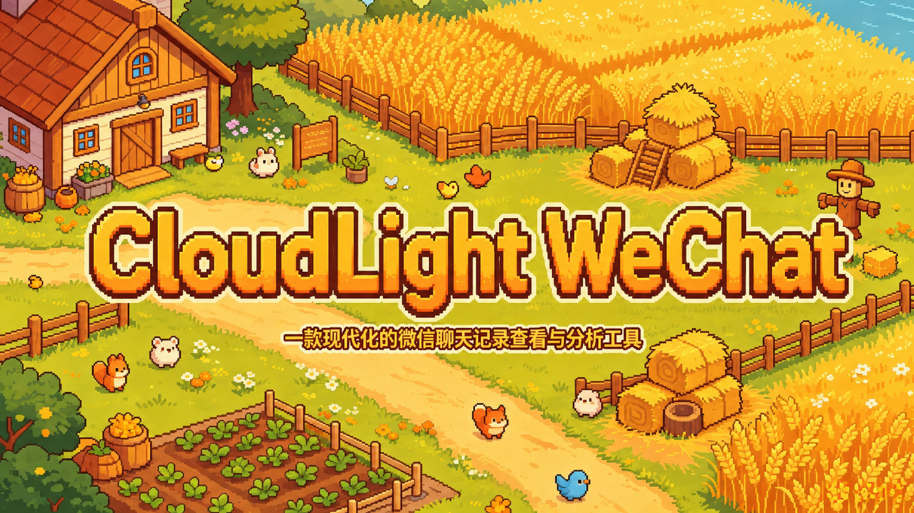

<div align="center">



# CloudLight WeChat

**一款现代化的微信聊天记录查看与分析工具**

[](LICENSE)
[](package.json)
[](https://github.com/Cloud-Light125/CloudLight-WeChat/releases)
[](https://www.electronjs.org/)
[](https://react.dev/)

当前维护者：**Cloud-Light125**  ·  [项目仓库](https://github.com/Cloud-Light125/CloudLight-WeChat)  ·  [下载与 Releases](https://github.com/Cloud-Light125/CloudLight-WeChat/releases)  ·  [正式主页](https://269332.xyz)

[](https://269332.xyz)

</div>

## 项目简介

CloudLight WeChat 面向需要整理、查看、检索、备份和归档微信聊天记录的个人用户。它以本地数据处理为核心，提供桌面化的浏览、搜索、媒体查看、导出和分析能力，帮助用户从分散的聊天记录中找回上下文与线索。

核心聊天数据和应用配置以本地处理为主，但这不等于“所有数据绝不联网”。当用户主动启用 AI、通知、模型下载、语音转写、远程控制或其他网络功能时，应用会访问用户配置的外部服务；具体数据范围取决于所启用的功能和服务商。

## 下载与安装

请从 [CloudLight WeChat Releases](https://github.com/Cloud-Light125/CloudLight-WeChat/releases) 获取安装包。当前版本的预期文件名为：

- Windows：`CloudLight WeChat-2026.906.4-Setup.exe`
- macOS：`CloudLight WeChat-2026.906.4-Setup.dmg`

Windows 用户下载 `.exe` 后按安装向导操作；macOS 用户打开 `.dmg` 并将应用拖入 Applications。首次使用时，请按应用内引导选择微信数据位置并完成必要的访问授权。

## 功能特性

- 浏览会话、联系人和聊天消息，支持按关键词、时间和发送者检索。
- 查看图片、语音、视频、文件、表情和朋友圈等聊天媒体；可选使用本地或在线语音转写。
- 导出聊天记录、联系人和朋友圈内容，生成适合归档与分享的文件。
- 本地优先的数据目录与缓存管理，支持旧版本配置和缓存路径兼容迁移。
- 可选接入本地 Ollama、其他兼容 API、ChatGPT 订阅、模型服务、通知和远程功能。
- 内置 AI Agent、MCP 服务和插件系统，能力按权限与用户配置启用。

## 快速开始

### 使用已发布安装包

1. 从 [Releases](https://github.com/Cloud-Light125/CloudLight-WeChat/releases) 下载对应平台的安装包。
2. 安装并启动 CloudLight WeChat。
3. 按欢迎页提示选择微信数据目录、完成密钥或访问权限配置。
4. 在侧边栏选择会话，或使用搜索、导出和 AI 功能开始整理数据。

### 从源码运行

环境要求：

- Node.js 22.12.0 或更高版本（且满足 `package.json` 中的 Node 范围）
- Windows 10/11；macOS 构建需要对应的 macOS 原生工具链
- 建议至少 4GB 可用内存

```bash
npm install
npm run dev
```

## 数据存储与旧版本迁移

CloudLight WeChat 的当前文档数据目录为：

```text
Documents/CloudLight/CloudLight WeChat
```

应用会识别并迁移旧版本的配置与缓存，包括旧的 `AppData/ciphertalk`、`AppData/CipherTalk` 和 `Documents/CipherTalk` 兼容路径。迁移是为了让旧用户能够继续使用已有数据；应用不会承诺自动删除旧目录或旧文件，用户可以在确认新目录可用后自行处理旧数据。

桌面应用仍保留 `com.ciphertalk.app`、`ciphertalk-config.db`、`CIPHERTALK_*` 环境变量以及相关协议、MIME、MCP 和原生模块标识，以维持 Windows 通知、安装升级和既有插件/数据的兼容性。

## 开发与构建

```bash
# 开发模式
npm run dev

# 类型检查
npx tsc --noEmit

# 构建完整安装包
npm run build

# 按平台构建
npm run build:win
npm run build:mac
```

构建产物写入 `release/`。发布工作流会从 `package.json` 的 `version` 与 `build.productName` 计算安装包名称，并在 GitHub Release、R2 镜像和构建产物验证中复用同一组名称。

## 命令行子项目

`CipherTalk-CLI/` 是保留名称的独立兼容子项目，公开 npm 包名为 `ciphertalk-cli`，命令为 `miyu`。它拥有独立的依赖、测试、构建和发布体系，不参与桌面端 Electron 构建；本次桌面品牌迁移不会重命名该目录、包名、命令或 CLI 的兼容接口。

```bash
npm install -g ciphertalk-cli
miyu status
```

在仓库根目录参与 CLI 开发：

```bash
npm run cli:install
npm run cli -- status
npm run cli:typecheck
npm run cli:test
```

## 插件开发

插件运行在独立沙箱 iframe 中，通过宿主提供的权限化 API 访问聊天数据、媒体、转写、搜索、导出、AI 和 UI 能力。完整说明见 [PLUGIN_DEV_GUIDE.md](PLUGIN_DEV_GUIDE.md)。

公开包名 `ciphertalk-plugin-sdk` 是保留的兼容名称，包含数据 SDK、`ciphertalk-plugin-sdk/ui` React 组件入口和 `ciphertalk-plugin` 脚手架命令。现有插件的导入路径、SDK 文件名、CLI 命令和插件协议不会因桌面品牌迁移而改变。

```bash
npm install ciphertalk-plugin-sdk
npx ciphertalk-plugin init my-plugin --vite
```

示例插件位于 [`examples/plugins/`](examples/plugins/)。

## 技术栈与开源组件

- Electron、React、TypeScript、Vite 和 Tailwind CSS
- HeroUI React v3、Gravity UI Icons、React Router
- SQLite/WCDB 相关原生模块、Koffi、Sharp、FFmpeg
- AI SDK、MCP SDK、Ollama 及可配置的兼容模型服务

各依赖的许可证与上游归属以其项目声明为准；本仓库中的原生组件、SDK 和兼容标识会按现有接口继续维护。

## 上游来源与致谢

本项目基于 [ILoveBingLu/CipherTalk](https://github.com/ILoveBingLu/CipherTalk) 继续维护，原作者与上游归属为 **ILoveBingLu**。当前 CloudLight WeChat 由 **Cloud-Light125** 在本仓库中维护；两者是上游原项目与当前维护分支的关系，不应混同为同一个当前官方渠道。

感谢 [WeFlow](https://github.com/hicccc77/WeFlow) 及所有为本项目提供思路、反馈和代码贡献的开发者。

## 贡献指南

欢迎通过 [Issues](https://github.com/Cloud-Light125/CloudLight-WeChat/issues) 报告问题、提出建议，或阅读 [CONTRIBUTING.md](CONTRIBUTING.md) 了解开发与提交约定。提交代码前请先确认改动不会破坏旧数据迁移、CLI/SDK/MCP 兼容标识和平台原生能力。

## 许可证

本项目采用 [CC BY-NC-SA 4.0](LICENSE) 许可证（知识共享 署名-非商业性使用-相同方式共享 4.0 国际许可协议）。请阅读 [LICENSE](LICENSE) 了解完整条款。

## 免责声明

- 本项目仅供学习、研究、个人数据整理与合法归档使用。
- 使用前请遵守所在地法律法规、微信用户协议及相关服务条款。
- 请仅处理你有权访问和处理的数据，并自行承担使用本软件产生的后果。
- 本项目不提供法律意见，也不保证任何导出内容具备特定法律效力。

## Contributors

感谢所有贡献者：

<a href="https://github.com/Cloud-Light125/CloudLight-WeChat/graphs/contributors">
  
</a>

## Star History

<div align="center">

<a href="https://www.star-history.com/#Cloud-Light125/CloudLight-WeChat&type=date&legend=top-left">
 <picture>
   <source media="(prefers-color-scheme: dark)" srcset="https://api.star-history.com/svg?repos=Cloud-Light125/CloudLight-WeChat&type=date&theme=dark&legend=top-left" />
   <source media="(prefers-color-scheme: light)" srcset="https://api.star-history.com/svg?repos=Cloud-Light125/CloudLight-WeChat&type=date&legend=top-left" />
   
 </picture>
</a>

<br />

<sub>一鲸落，万物生 · 愿每一段对话都被温柔以待</sub>

</div>
